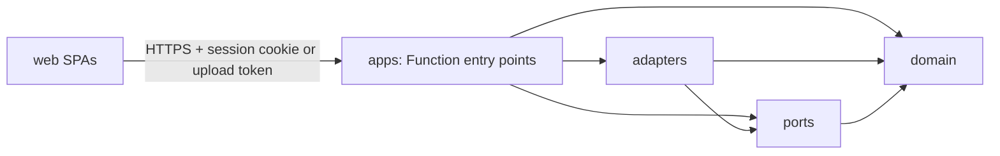
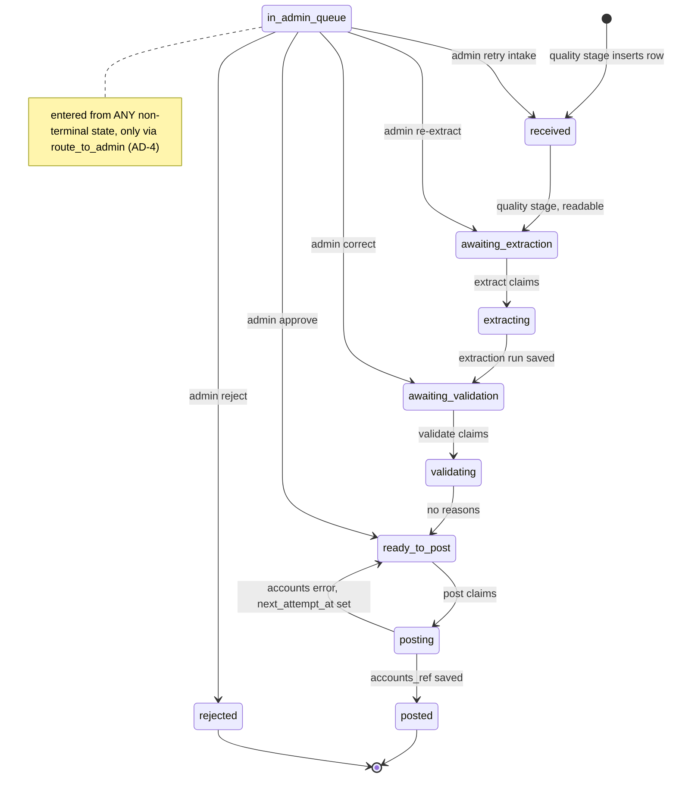
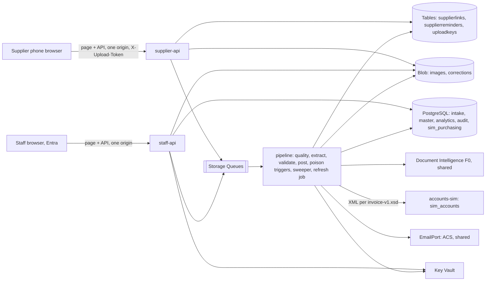
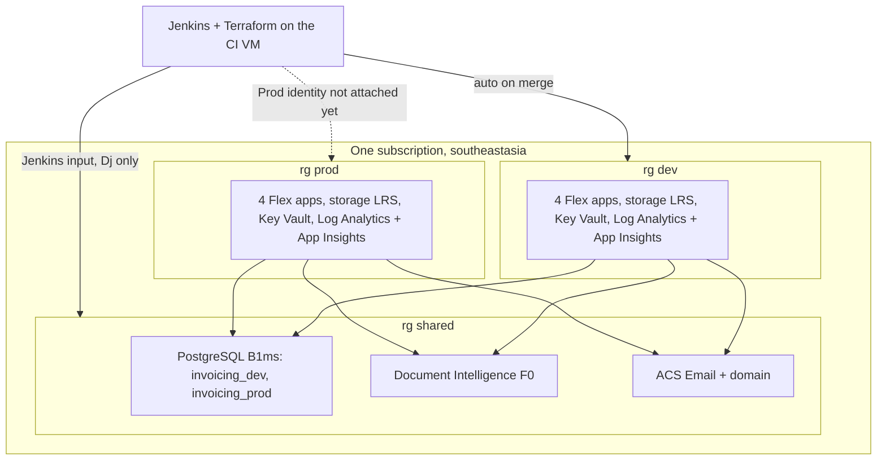

# Architecture Spine: OCR Invoice Automation PoC

Principles P-1 to P-20 (`docs/architecture/`) bind every AD. An AD that departs from one names it. Every AD is `[ADOPTED]`: Dj settled it. An inline `[ASSUMPTION]` marks a single value that still has to be calibrated in testing.

## Design Paradigm

- **Intake is pipes and filters (P-3).** Stages run quality check → extract → validate → post. Each stage is a queue-triggered function that never calls the next one. The admin queue is the single place exceptions go.
- **The core is ports and adapters.** Business rules live in a framework-free domain package (`coding-style.md` rule 9). Every outside system is reached through a port that has one adapter per implementation (P-4). The outside systems are Document Intelligence, the accounts XML API, PO/GRN data, blob storage, table storage, queues and email.
- **Analytics is a separate read side (P-10).** Tables in the `analytics` schema are written only by the refresh job. Dashboards only read them.

| Layer | Lives in | May depend on |
| --- | --- | --- |
| Domain: state machine, `route_to_admin`, validation and analytics rules, reason codes, money | `backend/src/invoicing/domain/` | nothing outside itself |
| Ports: Protocol interfaces and message/metadata models | `backend/src/invoicing/ports/` | domain |
| Adapters | `backend/src/invoicing/adapters/` | ports, domain |
| Apps: Function entry points | `backend/src/invoicing/apps/<app>/` | adapters, ports, domain |
| Web: two SPAs | `web/supplier/`, `web/staff/` | the HTTP APIs only, through `src/api/` |



## Invariants & Rules

### AD-1: Compute is Azure Functions Flex Consumption, four apps per environment [ADOPTED]

- **Binds:** all back-end code
- **Prevents:** code landing in a hosting model that can't be deployed, or one app mixing anonymous supplier routes with signed-in staff routes.
- **Rule:**
  - Python 3.13 on Functions host 4.x with the v2 decorator model, in `southeastasia`.
  - Each environment has four Flex apps, each in its own plan and each with its own user-assigned managed identity:
    - `supplier-api`: anonymous at the platform, upload token checked in code. It has no database login.
    - `staff-api`: built-in auth required.
    - `pipeline`: queue and timer triggers only, with no HTTP routes.
    - `accounts-sim`: built-in auth required.
  - All four use on-demand instances only.
  - Timers use UTC cron (Singapore time is UTC+8).
- **Cost (P-2):** about $0, within the free grant of 250K executions and 100K GB-s a month.

### AD-2: Stages hand off through Storage Queues, and whoever moves an invoice queues its next step [ADOPTED]

- **Binds:** CAP-1 to CAP-11, all pipeline stages, `staff-api` admin actions
- **Prevents:**
  - stages calling each other synchronously;
  - fat messages that drift from the database;
  - invoices stranded between a status change and the next queue message, or re-queued while they wait for an admin.
- **Rule:**
  - **Queues.** Each stage input has its own queue: `q-quality`, `q-extract`, `q-validate` and `q-post`.
  - **Message.** A message is exactly `QueueMessage{invoice_id, correlation_id, first_enqueued_at, attempt}`, defined in `ports/messages.py`. All data is read from blob storage and PostgreSQL.
  - **Hand-off.** The unit that performs a transition (AD-3) queues the next stage's message after its commit, and `staff-api` does the same after an admin action.
  - **Recovery from a crash between the commit and the enqueue.** Two mechanisms cover it:
    - A stage whose claim changes zero rows reads the invoice's status. If the status is that stage's final target, it re-enqueues the next stage (if any) and acknowledges. Otherwise it only acknowledges. The final targets are `awaiting_extraction` for quality, `awaiting_validation` for extract, `ready_to_post` or `in_admin_queue` for validate, and `posted` for post.
    - A `pipeline` sweeper timer runs every 15 minutes, separately from the AD-13 schedule. It re-enqueues invoices whose `status_changed_at` is more than 1 hour old and more than 1 hour after the database last started (`pg_postmaster_start_time()`), by this map:

      | Status | Queue |
      | --- | --- |
      | `received` | `q-quality` |
      | `awaiting_extraction`, or `extracting` with an expired lease | `q-extract` |
      | `awaiting_validation`, or `validating` with an expired lease | `q-validate` |
      | `ready_to_post` whose `next_attempt_at` is empty or past, or `posting` with an expired lease | `q-post` |

      It never touches `in_admin_queue`, `posted` or `rejected`. A duplicate message is harmless, because the next claim changes zero rows (AD-3).
    - The sweeper also deletes `uploadkeys` rows older than 24 hours (AD-6).
  - **Ordinary failures.** They retry with `maxDequeueCount` 5 and then go to the poison queue. A trigger on each `*-poison` queue calls `route_to_admin(PROCESSING_FAILED)` (AD-4), but only when the invoice is still in that queue's input state, or in its claim state with an expired lease. Otherwise the poison message is acknowledged.
  - **One message at a time per stage.** The `pipeline` app has a maximum instance count of 1, which Flex applies to each function separately, and its `host.json` sets `batchSize` 1 and `newBatchThreshold` 0. So each stage runs on one instance and handles one message at a time.
  - **Message encoding.** `host.json` sets `extensions.queues.messageEncoding` to `none`, and every producer (the stages, the sweeper, AD-7 re-enqueues, `supplier-api`, `staff-api`) sends plain JSON text through the `azure-storage-queue` SDK.
- **Cost (P-2):** about $0.12 a month.

### AD-3: One invoice status, a fixed state machine, and claim-before-side-effect [ADOPTED]

- **Binds:** `intake.invoice`, all pipeline stages, `staff-api` admin actions
- **Prevents:**
  - two units setting status inconsistently;
  - redelivered or duplicated messages calling Document Intelligence twice or posting twice.
- **Rule:**
  - **Status.** `intake.invoice.status` is the only lifecycle field. Only the transitions in the diagram exist.
  - **The invoice row.** `intake.invoice{id, correlation_id, source, supplier_id, delivery_id, content_type, device_check, photo_taken_at, po_number, status, status_changed_at, claimed_until, next_attempt_at, post_failures, accounts_ref, posted_at, created_at}`. `po_number` is the current PO (AD-19). `posted_at` equals the `at` of the `status_history` row that moved the invoice to `posted`.
  - **Transitions.** Every transition goes through one domain function that runs a conditional `UPDATE … WHERE id = :id AND status = :from` and, in the same transaction, inserts an `intake.status_history` row `{invoice_id, from_status, to_status, actor, at}`.
  - **Claim first.** A stage with a side effect claims first, by moving the invoice to `extracting`, `validating` or `posting` with a 10-minute lease.
    - An expired lease may be reclaimed.
    - A claim that changes zero rows means another worker has the invoice, so the message is acknowledged.
  - **Save the result before finishing.** The side effect's result is saved under `invoice_id` before the final transition, and a retry reuses it. The saved results are the extraction run (AD-18) and the `accounts_ref`. Extract reuses a saved run only if it was created after the invoice last entered `awaiting_extraction` (from `status_history`), so a Re-extract always reads again.
  - **Posting backoff.** When the accounts call fails, the `post` stage moves the invoice back from `posting` to `ready_to_post`, increments `post_failures`, sets `next_attempt_at` 1, 5, 15 or 60 minutes ahead, and re-enqueues with that delay (AD-10), all in one transaction.
    - The lease is released, so the sweeper and the lease never compete.
    - The post claim adds `AND (next_attempt_at IS NULL OR next_attempt_at <= now())`. A message that arrives too early is re-enqueued with the remaining delay.
    - The 5th failure is decided from `post_failures`, never from `QueueMessage.attempt`, which is informational. `post_failures` resets when the invoice enters `ready_to_post` from `validating` or `in_admin_queue`.
  - **Admin actions.** Only `staff-api` (admin role) moves an invoice out of `in_admin_queue`. Each action's rows and its transition are one transaction, and the action is allowed only for the invoice's open reasons (AD-4):
    - **Correct** saves the corrected fields as `source=admin` rows with confidence 1.0 (AD-18), then moves the invoice to `awaiting_validation`. The `corrections` blob (AD-15) is written after the commit.
    - **Approve** records a reason, for example "bank details verified by call-back", then moves it to `ready_to_post`.
    - **Re-extract** is allowed only for `EXTRACTION_QUOTA` and `PROCESSING_FAILED`. It moves the invoice to `awaiting_extraction`.
    - **Retry intake** is allowed only for `PROCESSING_FAILED` when the quality stage never completed (no `image_hash` row and no `photo_taken_at` decision). It moves the invoice to `received` and re-enqueues `q-quality`.
    - **Reject** moves it to `rejected`. It is refused once `accounts_ref` exists; such an invoice can only be Approved, which re-posts it idempotently.



### AD-4: The admin queue has one entry function and one reason catalogue [ADOPTED]

- **Binds:** CAP-3 to CAP-9, CAP-11, the admin queue UI
- **Prevents:**
  - stages inventing their own reason strings or admin-row shapes;
  - an admin seeing only the first failed check.
- **Rule:**
  - **Reason codes.** `domain/reasons.py` holds the only reason codes:
    - `UNREADABLE`, `UNSUPPORTED_DOCUMENT`, `EXTRACTION_QUOTA`
    - `LOW_CONFIDENCE`, `PO_MISMATCH`, `DUPLICATE`, `DATE_MISMATCH`, `NO_PHOTO_DATE`
    - `BANK_CHANGED`, `SUPPLIER_ID_MISMATCH`
    - `ACCOUNTS_API_ERROR`, `PROCESSING_FAILED`
  - **One way in.** `domain.route_to_admin(invoice_id, reasons, from_status, metadata?)` is the only way into `in_admin_queue`.
    - It is a conditional transition like any other (AD-3): a stage passes its claim state, and zero rows changed means the result is discarded.
    - When the invoice row is missing, it creates it from the `IntakeBlobMetadata` passed in (AD-5). This is the only other place a row is created.
    - In the same transaction, it writes one `intake.admin_item` row per reason: `{id, invoice_id, routing_id, run_id?, reason, field_ids[], detail jsonb, created_at}`. `routing_id` is one UUIDv7 per call. `field_ids` are AD-18 field ids.
  - **Open reasons.** An invoice's open reasons are the items of its latest `routing_id`. The queue, the item view and every action guard read only those. Resolutions go to `audit.event`. `admin_item` has no status column.
  - **Validation is one stage.** It runs every check in AD-19 and routes all the failing reasons together.

### AD-5: The supplier is fixed by whoever writes the intake, never taken from OCR (P-5) [ADOPTED]

- **Binds:** CAP-1, CAP-2, CAP-9
- **Prevents:** two units resolving the supplier differently, and OCR output overwriting it.
- **Rule:**
  - **The intake writer resolves the supplier and nothing changes it afterwards.**
    - For a supplier upload, `supplier-api` takes it from the link registry (AD-6).
    - For a goods-in scan, `staff-api` (role `goods_in`) takes it from `PurchasingPort.get_delivery(delivery_id)`. Goods-in needs the database to be up.
  - **Blob metadata.** Both writers put the supplier into the blob metadata as `IntakeBlobMetadata{invoice_id, source: link|goods_in, supplier_id, delivery_id?, content_type, uploaded_at, device_check: passed|overridden|skipped}` (in `ports/intake.py`). `skipped` means the page couldn't run its check; the server treats it like `passed` (Dj, 2026-09-29).
  - **Creating the invoice row.** Only the `quality` stage inserts `intake.invoice`, using `INSERT … ON CONFLICT (id) DO NOTHING`. The one other path is `route_to_admin` with the metadata (AD-4).

### AD-6: The upload path never touches PostgreSQL [ADOPTED]

- **Binds:** CAP-1, CAP-3, CAP-13, P-8
- **Prevents:** supplier uploads, and the reminders shown on the supplier page, failing while the database is stopped (AD-12), and link tokens reaching logs.
- **Rule:**
  - **Links.**
    - A link token is 256 random bits, encoded base64url.
    - The link is `https://<supplier-api host>/u#<token>`. The token sits in the URL fragment, which browsers never send to the server. The page reads it and sends it in the `X-Upload-Token` header on every call.
    - The Azure Table `supplierlinks` stores `SHA-256(token) → supplier_id, supplier_name, issued_at, revoked_at`. The token itself is never stored. `supplier_name` is for display on the page only.
    - To revoke a link, `revoked_at` is set, and a revoked link accepts no uploads.
    - Only the supplier load script issues and revokes links. **This departs from P-8** ("issued and revoked automatically"); Dj accepted it. It is run by an operator, goes through the application code, and adds or updates suppliers in `master`. It prints each new link once, for Dj to send to the supplier on WhatsApp or SMS. `--replace-link` revokes a supplier's link and issues a new one; `--revoke` revokes it without issuing another.
  - **Uploads.** `supplier-api` accepts JPEG, PNG or PDF files of 4 MB or less. It uses only Table Storage, blob storage and `q-quality`, in this order:
    1. It creates `invoice_id` (UUIDv7) and inserts `Idempotency-Key → invoice_id` into the Table `uploadkeys` if absent. The page sends the key, a UUID created once for each chosen file. If the key already exists, the stored `invoice_id` is used instead.
    2. It writes the original, unmodified bytes to `images/<invoice_id>` with the AD-5 metadata, unless the blob already exists.
    3. It enqueues the message and returns the `invoice_id` and supplier reference.

    A retry with the same key within 24 hours replays steps 2 and 3, so a failed first attempt is completed and a second invoice is never created. A duplicate message is harmless (AD-2). The sweeper deletes older keys. Goods-in uploads through `staff-api` follow the same rule.
  - **Checks.** The page checks blur and darkness on the device before submitting (CAP-3). The `quality` stage then does the following:
    - applies the EXIF orientation;
    - checks readability again with the same measures and thresholds as the page: variance of the Laplacian for blur and mean luminance for darkness, computed with Pillow. The thresholds live in one file, `quality-thresholds.json`, read by both `web/supplier` and `pipeline/quality` (values `[ASSUMPTION]` until calibrated on sample photos). An upload whose `device_check` is `overridden` (the supplier chose "Send it anyway" after 2 failed checks) is processed normally when it passes, and goes to `UNREADABLE` when it fails;
    - rejects a PDF of more than 2 pages as `UNSUPPORTED_DOCUMENT`;
    - saves `photo_taken_at` from EXIF into the database (AD-19 says how its time zone is read);
    - computes the perceptual hash (AD-9).
  - **Reminders** (CAP-13) are shown only as the upload-page banner, with no email to suppliers. The Table `supplierreminders` has `PartitionKey=supplier_id` and `RowKey=po_number`. The analytics refresh job writes it (AD-13), and `supplier-api` reads a supplier's partition. The `validate` stage deletes a PO's row as soon as an invoice matched to that PO arrives, so the banner never lists a PO that has already been invoiced.
- **Cost (P-2):** about $0.01 a month.

### AD-7: Consumers wait out a stopped database instead of failing [ADOPTED]

- **Binds:** every `pipeline` function and timer, including the poison triggers
- **Prevents:** invoices uploaded overnight burning their retries and being lost while Dj has the database stopped.
- **Rule:**
  - A consumer that can't connect to PostgreSQL re-enqueues the same message with a 15-minute visibility delay. The copy keeps `first_enqueued_at` and `attempt`. The consumer then completes the original, so the dequeue count is not used up.
  - Poison triggers follow the same rule, so no message is dropped.
  - The wait is bounded, because a stopped server restarts itself after 7 days.
  - A timer that finds the database down exits and catches up at its next run (AD-13).
  - Document Intelligence 429 responses use the same re-enqueue, delayed by `Retry-After`.

### AD-8: Extraction uses the shared F0 Document Intelligence resource within per-environment caps [ADOPTED]

- **Binds:** CAP-4, CAP-10, the `extract` stage
- **Prevents:** Dev and Prod together exceeding F0's 500 pages a month or its 1 request a second, and a second extraction path appearing.
- **Rule:**
  - **One caller.** Only `adapters/document_intelligence.py` calls Document Intelligence:
    - API `2024-11-30`;
    - authenticated with managed identity, through the resource's custom subdomain;
    - with each environment's `pipeline` identity holding Cognitive Services User on the one shared resource (the assignment is made as AD-17 describes).
  - **Currency.** The invoice currency comes from configuration (`INVOICE_CURRENCY=SGD`), not from DI, which lists neither SGD nor an English (Singapore) locale.
  - **Model choice.** `ModelSelector` picks the model per supplier format. The default is `prebuilt-invoice`, and the CAP-10 seam is only this port.
  - **Rate.** The adapter sends at most 1 request every 2 seconds in each environment, polling calls included, so both environments together stay at 1 a second or less. `extract` runs on one instance (AD-2), and the last call time is also kept in `intake.di_usage` under `pg_advisory_xact_lock`, so the limit holds across restarts and redeploys.
  - **Page caps.** Pages are counted per calendar month in `intake.di_usage`, against a configured cap of Dev 100 and Prod 400. Pages are reserved under the same lock before the analyze call, so two instances can't both pass the check. When the cap is reached, or DI returns a quota error, the invoice goes to `EXTRACTION_QUOTA`.
  - **Polling.** The `Operation-Location` is saved against `invoice_id` before polling. A retry, including one after a 429, resumes polling it instead of analysing again.
  - **Output.** The adapter maps the DI result into the AD-18 rows and drops the raw result.
  - **Training.** Dev never trains custom models (P-13).
  - **Moving to S0** changes only configuration.
- **Cost (P-2):** $0 on F0. S0 would cost $10 per 1,000 pages.

### AD-9: Duplicates are caught by a fingerprint plus a perceptual hash, with no AI (P-9) [ADOPTED]

- **Binds:** CAP-6
- **Prevents:**
  - duplicate logic split between stages;
  - two copies passing at the same time;
  - an invoice matching itself.
- **Rule:**
  - The `quality` stage stores a 64-bit `phash` (ImageHash, taken after EXIF orientation) for images in `intake.image_hash`. PDFs get the fingerprint check only.
  - The `validate` stage holds `pg_advisory_xact_lock` on the `supplier_id` while it checks and records. It compares only with the same supplier's invoices that are not `rejected` and that come earlier in `invoice_id` (UUIDv7) order, so of two copies only the later one is flagged. It raises `DUPLICATE` in either case:
    - the fingerprint `(supplier_id, normalised invoice_number, invoice_total, invoice_date)` matches;
    - the Hamming distance between the hashes is 8 or less (threshold `[ASSUMPTION]`).
  - Hashes are kept after the images are deleted.

### AD-10: One adapter for each on-premises system, with simulations behind the same contracts (P-4) [ADOPTED]

- **Binds:** CAP-5, CAP-11, CAP-12, CAP-14 to CAP-17, CAP-19, CAP-20
- **Prevents:**
  - capability code knowing whether a system is simulated;
  - XML leaking out of the accounts adapter;
  - the simulator and the adapter drifting apart;
  - retries stacking up.
- **Rule:**
  - **Accounts port.** `AccountsPort.post_invoice(invoice) -> accounts_ref` is idempotent on `invoice_id`, and a repeat call returns the same reference.
    - One adapter, `adapters/accounts_xml/`, builds and parses the XML. Every request it sends is valid against `adapters/accounts_xml/invoice-v1.xsd`, which is the contract.
    - `accounts-sim` accepts the same XSD over HTTPS, validates each request against it, and stores the result in schema `sim_accounts`. It is called with a managed-identity token (P-6, P-18).
    - `accounts-sim` has its own app registration in each environment (AD-17). Its built-in auth accepts only its own environment's `pipeline` identity (`allowedPrincipals.identities`) and refuses human users.
    - Switching from the simulation to the real system changes only `ACCOUNTS_BASE_URL` and the auth settings.
    - The adapter never retries. On an accounts error, the `post` stage backs off for 1, 5, 15 and 60 minutes (AD-3).
    - On the 5th failure, the invoice goes to `route_to_admin(ACCOUNTS_API_ERROR)` with the error in `detail`.
  - **Purchasing port.** `PurchasingPort` offers `get_po`, `get_receipts`, `get_delivery`, `list_overdue_pos` and `get_delivery_dates`.
    - **Purchasing owns materials.** `get_po(po_number)` returns the supplier and the lines, each with `po_line_id`, `material_id`, `material_name`, `supplier_product_code`, `unit_price`, `quantity` and `expected_date`.
    - `get_receipts(po_number)` returns the goods receipts, each with `received_date` and the received quantity per `po_line_id`.
    - PO and goods-received data sit in schema `sim_purchasing`. Only the module `adapters/purchasing_sim/` reads it. An import-linter rule enforces that, so no per-adapter database role is needed.
    - Switching to the real system changes one setting (`PURCHASING_ADAPTER`).
- **Cost (P-2):** $0.

### AD-11: The database has schemas with a single writer each, and bank details are protected wherever they appear (P-7) [ADOPTED]

- **Binds:** all persistent data, CAP-8, CAP-9
- **Prevents:**
  - two owners writing one entity;
  - bank details, or images showing them, readable by non-admin roles;
  - Dev reaching Prod data;
  - a role holding more than its app needs.
- **Rule:**

  | Schema | Holds | Written only by | Read by |
  | --- | --- | --- | --- |
  | `intake` | invoices, status history, extraction runs, fields, lines, admin items, image hashes, DI usage | `pipeline` stages; `staff-api` admin actions (AD-3, AD-4) | `staff-api`, analytics refresh |
  | `master` | `supplier{id, name, tax_id, phone}`; `supplier_bank{supplier_id, field_id, ciphertext, fingerprint}`, one row per AD-18 bank field id | the supplier load script (through application code) | `pipeline` (no ciphertext), `staff-api` |
  | `analytics` | summary tables, alerts, the overdue list | the analytics refresh job (AD-13) only | `staff-api` dashboards |
  | `sim_purchasing` | POs, lines, materials, deliveries, receipts | the simulation seed | the purchasing adapter (AD-10) |
  | `sim_accounts` | posted invoices | `accounts-sim` | `accounts-sim` |
  | `audit` | `event(id, at, actor, action, entity, entity_id, detail)` | every app with a database login, `INSERT` only (`security.md` rule 32) | admin, through `staff-api` |

  - **Where bank details are protected.** In `master` and in extracted invoice fields alike, each value is stored as `pgp_pub_encrypt` ciphertext plus an HMAC-SHA256 fingerprint, from its first write (the `extract` stage).
    - Before fingerprinting, the value is normalised by stripping spaces and hyphens and converting to uppercase.
    - The public key and the HMAC key are in the environment's Key Vault, readable by `pipeline` and the load script (per secret). The private key lives in a separate private-key vault in the bootstrap-only resource group `rg-22` (`kv-22` Dev, `kv-23` Prod), created by the bootstrap and filled by the operator step 4b. Only that environment's `staff-api` identity has a role on it, so no deploy identity, pipeline identity or operator's everyday login can read it, and only `staff-api` can decrypt (Dj, 2026-09-29).
  - **How they are compared.** CAP-8 compares fingerprints field by field (the same bank field id on both sides) and never decrypts.
  - **Who can see them.**
    - Correction JSON, `audit.event.detail` and logs never hold plaintext bank values.
    - `staff-api` serves images, crops and decrypted bank details only to the `admin` role.
  - **Database logins.** PostgreSQL uses Entra-only auth. Logins exist once per server, and each can connect only to its own environment's database. Each environment has these logins, and no other:

    | Login | Grants in its environment's database |
    | --- | --- |
    | `pipeline` identity | `intake` read/write; `master` read, except ciphertext columns; `analytics` read/write; `sim_purchasing` read; `audit` insert |
    | `staff-api` identity | `intake` read/write; `master` read, including ciphertext; `analytics` read; `sim_purchasing` read; `audit` insert and select |
    | `accounts-sim` identity | `sim_accounts` read/write only |
    | Dj's loaders group, with Dj as a member (the load script; Dj, 2026-09-29: guest UPN over 63 characters) | `master` read/write; `audit` insert |
    | the environment's deploy identity | owns the schemas and runs the migrations |

    - `supplier-api` has no database login.
    - An operator, as the server's Entra admin, prepares each database once (AD-17 step 5): creates the logins with `pgaadauth_create_principal`, makes the environment's deploy identity the database owner, revokes `CONNECT` from `PUBLIC`, and grants `CONNECT` to that environment's logins only. So a Dev login can't connect to `invoicing_prod`.
    - Every schema grant is an Alembic migration.
    - `pgcrypto` is allow-listed in `azure.extensions` through Terraform.
- **Cost (P-2):** Key Vault costs about $0.03 a month.

### AD-12: One PostgreSQL server holds both environments and is stopped out of hours [ADOPTED]

- **Binds:** the database, the environments, P-2, P-13
- **Prevents:** Dev code reaching Prod data on the shared server, and the ceiling being blown by two servers.
- **Rule:**
  - **The server:**
    - PostgreSQL Flexible Server B1ms, PostgreSQL 18, 32 GB;
    - 7-day locally redundant backup, no geo-backup (P-15);
    - in the `shared` resource group;
    - with two databases, `invoicing_dev` and `invoicing_prod`.
  - Each environment's logins can connect only to its own database (AD-11).
  - **Hours.** Dj stops the server by hand. The assumed up-hours are weekdays 09:00–21:00 Singapore time `[ASSUMPTION]`.
  - **Budget.** The resource-group budgets alert Dj; the $8 subscription budget was dropped because the subscription holds Dj's other projects (Dj, 2026-09-30).
  - **Departs from** P-13 and `terraform.md`'s "environments share nothing", at server level only (Dj's decision).
- **Cost (P-2):** about $10–11 a month. With it, **the whole solution is about $11–12 a month, which departs from P-2**, accepted by Dj.

### AD-13: Scheduled jobs run on weekdays while the database is up, and catch up from watermarks [ADOPTED]

- **Binds:** CAP-12 to CAP-18
- **Prevents:** jobs skipping days, two writers racing on `analytics`, and duplicate alerts.
- **Rule:**
  - **When jobs run.** `pipeline` timers run Monday to Friday at 01:30, 04:30 and 08:30 UTC. Each job does its work at most once a day, at the first run that finds the database up.
  - **The analytics refresh job is the only writer of `analytics`.** It works incrementally from a `posted_at` watermark and applies the AD-20 rules. It owns the CAP-14 and CAP-15 alerts, each stored once in `analytics.alert` so it is never raised twice.
  - **Overdue list** (CAP-12): built by the same job, into `analytics.overdue_po`, each weekday (Dj's decision; CAP-12 reads "each weekday").
    - A PO is overdue when its earliest line `expected_date` is before today (Singapore date) and no invoice that is not `rejected` has it as its current `po_number` (AD-19). Unlike AD-20, "invoiced" here does not wait for posting.
    - A PO whose expected date falls on a weekend appears on Monday's list. The list is computed from the last successful run, so no PO is missed.
  - **Supplier reminders** (CAP-13): at its first successful run of each ISO week, the same job replaces each supplier's partition in `supplierreminders` (AD-6) with its overdue POs. It re-checks each PO against `intake` just before writing its row, so a delete by `validate` is not undone.
  - **The sweeper** (AD-2) is not one of these jobs; it runs every 15 minutes.
  - **Dashboards** read only from `analytics.*` (P-10).

### AD-14: Each API serves its own web app from one origin; staff use built-in auth and suppliers use link tokens (P-14, P-19) [ADOPTED]

- **Binds:** CAP-1, CAP-2, CAP-9, CAP-14 to CAP-18, web apps
- **Prevents:**
  - a second region for web hosting;
  - CORS between the page and its API;
  - role checks that differ between routes;
  - any user in the tenant reaching the staff app.
- **Rule:**
  - **Hosting.** `supplier-api` serves the built `web/supplier` app and `staff-api` serves the built `web/staff` app.
    - The built files are packaged into each Function app, so each page and its API share one origin in `southeastasia`.
    - No other web hosting is used, and there is no CORS (`security.md` rule 23).
    - Every response carries the security headers in `security.md` rule 25, set by the app.
  - **Staff sign-in:**
    - `staff-api` uses built-in auth with a single-tenant Entra app registration, with "assignment required" set to yes. Dev and Prod each have their own registration (P-13), created by the bootstrap script (AD-17).
    - It redirects to Entra login and keeps a session cookie (`SameSite=Lax`). The login uses ID tokens only, so there is no client secret. The bootstrap enables ID-token issuance, and an operator step registers the redirect URI `https://<staff-api host>/.auth/login/aad/callback` once the app exists (AD-17 step 8).
    - Every call from the page sends `X-Requested-With: XMLHttpRequest`. With that header, built-in auth returns 401 instead of redirecting, and it is also the CSRF custom header (`security.md` rule 24).
    - The app roles are `admin`, `finance`, `procurement`, `management` and `goods_in`, assigned to each user individually. A user with several roles sees the surfaces of all of them.
    - MFA comes from Entra Security Defaults. That MFA is risk-based, not required at every sign-in. **This departs from P-19**, and Dj accepted it (Entra ID Free).
    - Every route checks its role in the domain layer.
    - Per-user conveniences, such as the admin keyboard-shortcut setting, stay in the browser's `localStorage`. The server keeps no user profile.
  - **Supplier upload.** `supplier-api` accepts only the upload token (AD-6). This is the exception to `security.md` rule 4 that P-19 allows, and it departs from `azure.md` rule 12 (anonymous at the edge; recorded under its Accepted exceptions). The token never appears in URLs sent to the server or in logs.
- **Cost (P-2):** $0. The first page load after an app has scaled to zero waits a few seconds.

### AD-15: Retention is enforced by blob lifecycle rules (P-11) [ADOPTED]

- **Binds:** images, admin corrections, CAP-10
- **Prevents:** raw corrections kept in PostgreSQL where no platform rule can delete them.
- **Rule:**
  - Images go in the `images` container. Each raw admin correction goes to the `corrections` container as JSON.
  - A lifecycle rule deletes both after `daysAfterCreationGreaterThan: 30`.
  - Storage is LRS with 7-day soft delete.
  - Corrected field values, `photo_taken_at`, hashes and custom models are kept in the database or in DI.
- **Cost (P-2):** under $0.05 a month.

### AD-16: Notifications go through one EmailPort, on ACS Email with Dj's own domain [ADOPTED]

- **Binds:** CAP-14, CAP-15
- **Prevents:** each capability picking its own channel, and a provider swap touching capability code.
- **Rule:**
  - Only `adapters/email.py`, behind `EmailPort`, sends mail.
  - It throttles per environment, with no shared state: Dev at most 5 a minute and 20 an hour, Prod at most 25 a minute and 80 an hour. Together they stay within the domain's 30 a minute and 100 an hour.
  - The provider is ACS Email, in the `shared` resource group, with managed identity, sending from a verified custom domain that Dj owns.
  - ACS Email and its domain are created with Story 5.2 "Staff alert emails", their only user, not with Story 1.1 (Dj, 2026-09-30).
  - Recipients are configured per environment and per role (`ALERT_RECIPIENTS_<ROLE>`).
  - Emails never carry bank details or link tokens.
  - ACS Email retires on 2028-09-30. The replacement is in Deferred.
  - Suppliers get no email. Their reminders are the upload-page banner only (AD-6).
- **Cost (P-2):** under $0.01 a month.

### AD-17: Environments, IaC, delivery and operations [ADOPTED]

- **Binds:** all infrastructure, P-12, P-13, P-15 to P-17, P-20
- **Prevents:**
  - each unit inventing names, tags, deployment paths or alerts;
  - two stacks owning one resource;
  - a Dev deployment reaching Prod;
  - a deploy identity needing rights it doesn't have.
- **Rule:**
  - **Resource groups.** One subscription with resource groups `shared`, `dev` and `prod`.
  - **Terraform** follows `terraform.md`. Every resource belongs to exactly one step:

    | Step | Owner | Creates |
    | --- | --- | --- |
    | 1. `infra/bootstrap/` | operator with Owner, `az` CLI | the state containers `ocrinvoicing-shared`, `-dev` and `-prod` in Dj's existing state account `stdjtfstatesea` (`rg-tfstate-sea`; checked for Entra-only auth and versioning, never changed; Dj, 2026-09-30); the three resource groups; deploy identities for `dev`, `prod` and `shared` (no federated credentials; Dj, 2026-09-29); resource provider registrations; per environment, two Entra app registrations: `staff-api` (app roles, "assignment required", ID tokens on) and `accounts-sim`; the custom role `ACS Email Sender`, allowing only the email send action (Microsoft documents only the broad Communication and Email Service Owner role otherwise). No subscription budget (Dj, 2026-09-30: dropped, the subscription holds other projects; the resource-group budgets track this project) |
    | 1c. `infra/bootstrap/ci-vm.sh` | operator with Owner, `az` CLI | the CI VM (Ubuntu, B2s: 2 vCPU, 4 GB, in resource group `babaloo-sea-lng-rg-23`), its NSG (SSH from the operator's IP only, no web port), Docker and Jenkins; attaches the shared and Dev deploy identities (Dj, 2026-09-29) |
    | 2. `shared/foundation` | `shared` deploy identity | PostgreSQL server, both databases, Entra admin, a firewall rule open to all public IPv4 addresses (`0.0.0.0`–`255.255.255.255`) with TLS required and Entra-only auth (departs `azure.md` rule 13, Dj's decision for the PoC), `pgcrypto` allow-list; DI F0 with custom subdomain; the `shared` resource-group budget. ACS and the email domain (the DNS records are added by hand) are added here by Story 5.2, not Story 1.1 (Dj, 2026-09-30) |
    | 3. Operator step (bootstrap README) | operator | gives each environment's deploy identity RBAC Administrator on the DI resource, conditioned to assigning only Cognitive Services User. Story 5.2 adds the same on ACS, conditioned to `ACS Email Sender` (Dj, 2026-09-30) |
    | 4. `<env>/foundation` | env deploy identity | the four app identities; storage account with containers, queues, tables, lifecycle rule and soft delete; Key Vault with the HMAC key generated by Terraform (the deploy identity holds Key Vault Secrets Officer on its own vault only; the PGP key pair comes from step 4b); Log Analytics, Application Insights and an action group; the resource-group budget |
    | 4b. Operator step (bootstrap README), once per environment | operator, holding Key Vault Secrets Officer on that vault | generates the PGP key pair offline with `gpg` (RSA 3072, ASCII-armoured, no passphrase, so `pgp_pub_decrypt` needs none), stores it as the secrets `pgp-public-key` and `pgp-private-key`, then deletes the local copies. Terraform can't generate OpenPGP keys, and `terraform.md` rule 28 forbids a provisioner, so Terraform never manages these two secrets |
    | 5. Operator step (bootstrap README), once per environment | operator, as PostgreSQL Entra admin | the database logins, ownership and `CONNECT` rules in AD-11; Dj's loaders group, with Dj as a member, gets Key Vault Secrets User and Storage Table Data Contributor on that environment's vault and storage account, for the load script (Dj, 2026-09-29: guest UPN over 63 characters) |
    | 6. Migrations | pipeline, as the env deploy identity | Alembic `upgrade head`, including every schema grant |
    | 7. `<env>/app` | env deploy identity | the four Flex plans and apps, their settings, built-in auth, the runtime role assignments below, metric alerts |
    | 8. Operator step (bootstrap README), once per environment | operator | registers the `staff-api` redirect URI on its app registration |
    | 9. Code deploy, every run | pipeline, as the env deploy identity | builds each app's package (the SPA build included in `supplier-api` and `staff-api`) and publishes it to the Flex app's deployment container (one deploy) |

    - **Runtime roles** (`azure.md` rule 9), each at the narrowest scope:

      | Identity | Roles |
      | --- | --- |
      | `supplier-api` | Storage Blob Data Contributor on `images`; Storage Queue Data Message Sender on `q-quality`; Storage Table Data Contributor on the storage account's tables |
      | `staff-api` | Storage Blob Data Contributor on `images` and `corrections`; Storage Queue Data Message Sender; Storage Table Data Contributor; Key Vault Secrets User |
      | `pipeline` | Storage Blob Data Contributor; Storage Queue Data Contributor; Storage Table Data Contributor; Key Vault Secrets User; Cognitive Services User on DI; `ACS Email Sender` on ACS |
      | `accounts-sim` | none beyond its own deployment storage |
      | every app | Storage Blob Data Owner on its own deployment container; Monitoring Metrics Publisher on its Application Insights |

    - Environment stacks read `shared/foundation` outputs through `terraform_remote_state`. This departs from `terraform.md` rule 3, extending the server-level departure in AD-12.
  - **Repo and pipeline.** The code lives in Azure Repos. Jenkins, in Docker on the CI VM, runs the checks, Terraform, migrations and the code deploy. Each stage signs in as its stack's user-assigned deploy identity attached to the VM (`az login --identity --client-id`). Terraform comes from the Jenkins Terraform plugin, pinned. Only the shared and Dev identities are attached (Dj, 2026-09-29).
    - **Dev applies automatically** on merge to `main`, from a saved plan. This departs from `terraform.md` rules 26 and 33 and `security.md` rule 34 (Dj's decision).
    - **Prod and `shared`** apply a saved plan only after a manual approval, given in a Jenkins `input` step restricted to Dj (Dj, 2026-09-29).
    - **PR gating.** Jenkins polls Azure Repos, runs `ci/checks.sh` on each PR and posts a status; a branch policy on `main` requires that status. The ADO personal access token for polling and status is the only stored secret, in Jenkins credentials (Dj, 2026-09-29).
    - Alembic migrations run in the pipeline, never at app start.
    - **Database reachability.** While the PostgreSQL firewall is open (step 2), the migration step, the operator database step and Dj's load script connect directly over TLS with Entra tokens. The temporary firewall rules of `azure.md` rule 13 and `terraform.md` rule 36 are not used. Closing the firewall brings them back, and each environment's deploy identity then needs rights on the shared server's firewall rules.
  - **Replacements for the GitHub-specific standards rules:**
    - `security.md` rule 10 (OIDC) is met by managed identities, with no stored Azure credentials (Dj, 2026-09-29).
    - Rule 28 (Dependabot) is met by `pip-audit` and `npm audit` on every PR build, plus a weekly scheduled run.
    - Rule 30 (secret scanning) is met by `gitleaks` as a required PR status under branch policy (Dj, 2026-09-29).
    - GitHub Advanced Security for Azure DevOps is not used, because its per-committer cost would break P-2.
  - **Deploy identity rights.** Beyond `azure.md` rule 31, each environment's deploy identity holds only the conditioned RBAC Administrator from step 3, Key Vault Secrets Officer on its own vault, and Storage Blob Data Reader on the `shared` state container (to read the shared stack's outputs). The app registrations and the subscription budget stay with the bootstrap. These depart from rule 31 (Dj's decision).
  - **Compute ceilings** (`azure.md` rule 20): `pipeline` has a maximum instance count of 1 (AD-2). `supplier-api`, `staff-api` and `accounts-sim` have a maximum of 10 each, which keeps them within the B1ms connection limit. Instance memory is 2,048 MB. Raising any of these is an architecture change.
  - **Names** follow P-16, `babaloo-sea-lng-<type>-<nn>`. `nn` is 01–09 for Dev, 11–19 for Prod and 21–29 for shared. Storage accounts drop the hyphens (`babaloosealngst01`). The three resource groups follow the same pattern.
  - **Tags.** The five tags of P-17 replace the standards' six.
  - **Redundancy.** All storage is LRS (P-15).
  - **Monitoring.** Each environment has one Log Analytics workspace and one Application Insights instance, with sampling on, a 0.08 GB/day cap and 30-day retention. The 5 GB free allowance is per billing account.
  - **Alerts**, all sent to Dj. Storage queue metrics have no per-queue breakdown, so the queue and pipeline alerts use Application Insights custom metrics, with alerting on custom metric dimensions turned on (dimensions are dropped otherwise):
    - the resource-group budgets (`azure.md` rule 17) (the $8 subscription budget was dropped, Dj 2026-09-30);
    - `poison_message{queue}`, emitted by each poison trigger, more than 0 in an hour;
    - `stuck_invoices`, emitted by the sweeper, more than 0;
    - `di_pages_used_pct`, emitted by the `extract` stage, at 80% of an environment's cap.
- **Cost (P-2):** about $0.30 a month for the metric alerts. Ingestion is within the free allowance, and the daily cap bounds it (Dj chose no separate log-cap alert).

### AD-18: Extraction results are stored as typed field and line rows, one run at a time [ADOPTED]

- **Binds:** CAP-4, CAP-5, CAP-9, CAP-10, CAP-14 to CAP-18, the `extract` and `validate` stages, admin Correct
- **Prevents:**
  - each stage or screen inventing its own shape for extracted data;
  - admin corrections overwriting what DI read;
  - bank details stored in plain text in a raw result.
- **Rule:**
  - **Runs.** Each extraction is one `intake.extraction_run{run_id, invoice_id, model_id, api_version, pages, created_at}`. This row is the saved result of AD-3. The raw DI response is not stored.
  - **Header fields.** Each is one `intake.invoice_field` row: `{invoice_id, run_id, field_id, value_text | value_number | value_date, currency, confidence, page, polygon, source: di|admin, created_at}`.
    - Bank fields store ciphertext plus fingerprint instead of a value (AD-11).
    - `polygon` drives the crop on the admin screen.
  - **Lines.** Each is one `intake.invoice_line` row: `{invoice_id, run_id, line_no, product_code, description, quantity, unit, unit_price, amount, tax, confidence, po_line_id, material_id, source}`. `confidence` is the lowest of the line's checked fields. `po_line_id` and `material_id` are filled by the `validate` stage (AD-19).
  - **Current value.** The current values are the rows of the invoice's latest `extraction_run`, overlaid by the `source=admin` rows that carry that `run_id`; for each field or line, the newest such row wins. Rows from earlier runs are never current, so a Re-extract drops earlier corrections. An admin correction adds a row with confidence 1.0 and never updates a DI row. A corrected line is written as a complete line row, copying every uncorrected column. Every reader (validation, the admin screen, analytics) uses this rule, through one domain function.
  - **Field ids.** DI names in snake_case (`vendor_name`, `vendor_tax_id`, `invoice_date`, `purchase_order`, `sub_total`, `total_tax`, `invoice_total`, …), except `InvoiceId`, which becomes `invoice_number`. Line fields are `line[<n>].<field>`. DI returns `PaymentDetails` as a list, so bank fields are `payment[<n>].bank_account_number`, `payment[<n>].iban` and `payment[<n>].swift`; their bank field id is the part after the dot.
  - **Checked fields** for `LOW_CONFIDENCE` (P-9, 0.90; Dj lowered it from 0.98 on 2026-09-30):
    - always: `vendor_name`, `invoice_number`, `invoice_date`, `sub_total`, `invoice_total`, and for every line `product_code`, `quantity`, `unit_price` and `amount`;
    - for supplier uploads: `purchase_order` (goods-in scans take the PO from the delivery);
    - when DI returns it: `vendor_tax_id`.

    A checked field that is missing counts as confidence 0. Other DI fields are stored but never checked. **This departs from P-9**, which sends any field below 90% to the admin queue; Dj accepted it, because checking every returned field would defeat the 90% straight-through target. Bank fields are not checked for confidence: a fingerprint match with the master proves the read, and a mismatch already raises `BANK_CHANGED` (AD-19).

### AD-19: Validation rules [ADOPTED]

- **Binds:** CAP-5 to CAP-9, the `validate` stage
- **Prevents:** two builders reading "matches", "differs" or "late" differently.
- **Rule:** The `validate` stage applies these rules to the current values (AD-18) and records every failure (AD-4).
  - **PO match** (`PO_MISMATCH`, CAP-5):
    - The PO is the extracted `purchase_order`, or for a goods-in scan the delivery's PO. It must exist and belong to the invoice's supplier.
    - Each invoice line is matched to a PO line by `product_code = supplier_product_code`, which fills `po_line_id` and `material_id`.
    - The pre-tax `sub_total` must be within the larger of 1% and 1.00 of the expected amount: the sum, over the matched lines, of the PO unit price times the quantity still to invoice. For a supplier upload, that is the quantity received so far (`get_receipts`) minus the current quantities on the other non-rejected invoices matched to the same `po_line_id`. For a goods-in scan, it is the quantity received on that delivery. It is computed under the same per-supplier lock as AD-9.
    - A missing or unknown PO, another supplier's PO, a line with no match, or a PO with no receipt raises `PO_MISMATCH`, with the expected and actual amounts in `detail`. Amounts use `Decimal`.
  - **Photo date** (CAP-7):
    - `photo_taken_at` is EXIF `DateTimeOriginal`, read as Singapore time unless `OffsetTimeOriginal` gives an offset.
    - Its date is compared with the PO's latest goods-received date. `DATE_MISMATCH` if the photo was taken before that date or more than 30 days after it.
    - With no photo date (PDFs, scans, stripped EXIF), the result is `NO_PHOTO_DATE`. With no matched PO or receipt, `PO_MISMATCH` already covers it.
  - **Printed supplier** (`SUPPLIER_ID_MISMATCH`):
    - If the invoice has `vendor_tax_id` and the supplier has `tax_id`, the two must be equal after normalising (uppercase, no spaces or punctuation).
    - Otherwise, the normalised `vendor_name` (casefolded, punctuation and legal suffixes such as "Pte Ltd" removed) must reach a token-set similarity of 85 or more with the supplier's name (rapidfuzz).
  - **Bank details** (`BANK_CHANGED`, CAP-8): any extracted bank field whose fingerprint differs from the supplier's value for the same field id, or for which the supplier has no value on file.
  - **Duplicates:** as in AD-9.
  - **Reminders:** a matched PO's `supplierreminders` row is deleted (AD-6).

### AD-20: Analytics rules [ADOPTED]

- **Binds:** CAP-14 to CAP-18, the analytics refresh job
- **Prevents:** each dashboard or alert computing prices, lateness or rates its own way.
- **Rule:**
  - **Inputs.** Prices come from posted invoices only, with lines read through the AD-18 current-value rule. The refresh reprocesses from its `posted_at` watermark minus 1 hour, idempotently by `invoice_id`, so a late commit is never skipped. Lateness and on-time rates are recomputed in full over the last 365 days on every run.
  - **Unit price** for a supplier and a material: the `unit_price` of the posted invoice line whose `material_id` is that material, in the invoice currency (SGD).
  - **Price rise** (CAP-14): a posted unit price more than 2% above the same supplier's previous posted price for that material, where "previous" is ordered by `invoice_date`, then `invoice_id`. Each rise raises one alert and counts once toward CAP-15. `analytics.alert` carries `emailed_at`, so an alert whose email was throttled or interrupted is still sent.
  - **Watchlist** (CAP-15), any one of the following:
    - 3 or more price rises in the last 365 days;
    - an average of 7 or more days late over the last 365 days;
    - a latest price 5% or more above the lowest latest price for the same material among suppliers who posted in the last 90 days.
  - **Lateness:** for each goods receipt, `received_date` minus the PO line's `expected_date`, in days. A receipt is on time when that is 0 or less. The on-time rate is on-time receipts divided by all receipts (CAP-17).
  - **Alternatives** (CAP-16): other suppliers with a posted price for the same material in the last 90 days, ranked by latest price, then by on-time rate.
  - **Straight-through share** (CAP-18, success signal): posted invoices whose `status_history` never includes `in_admin_queue`, divided by all posted invoices, per month.
  - **Flagged and duplicate counts** (CAP-18): per supplier and month, the invoices with at least one `admin_item`, and those with a `DUPLICATE` item, whether or not they were later posted. These are the one input not limited to posted invoices.

## Consistency Conventions

| Concern | Convention |
| --- | --- |
| Ids | UUIDv7 for every entity. `invoice_id` is created at upload. `correlation_id` is created once at upload and carried unchanged. |
| Field names | One canonical snake_case id per field, used in the DB, the API, reasons and logs (`coding-style.md` rule 3). Extracted fields follow AD-18. |
| Money | Python `Decimal`, and `numeric(18,2)` in the database. On the wire, amounts are strings with 2 decimals plus an ISO 4217 `currency`. |
| Dates | Dates as `YYYY-MM-DD`; timestamps as ISO 8601 UTC. `photo_taken_at` follows AD-19. |
| Errors | The domain raises errors carrying AD-4 reason codes or the API codes in `domain/errors.py`. The API error shape is `{code, message, correlation_id}`. When `staff-api` can't reach PostgreSQL, it returns HTTP 503 with code `DB_OFFLINE`, which the staff app shows as the offline notice. |
| Logging | Log ids, reason codes and timings only. Never field values, bank details, link tokens or headers. One App Insights trace per `correlation_id`. |
| Config | One `pydantic-settings` object per app. Adapters are chosen by setting (`PURCHASING_ADAPTER`, `ACCOUNTS_BASE_URL`). DI page caps and email throttles are set per environment. |
| Auth between services | User-assigned managed identity for each app. The only secrets are the PGP key pair and the HMAC key (AD-11), which live in Key Vault. |

## Stack

| Name | Version |
| --- | --- |
| Python | 3.13 |
| Azure Functions host (Flex Consumption, Python v2 model) | 4.x |
| Document Intelligence API | 2024-11-30 |
| azure-ai-documentintelligence | 1.0.2 |
| PostgreSQL (Flexible Server, B1ms) | 18 |
| psycopg | 3.3.6 |
| SQLAlchemy (Core) | 2.1.1 |
| Alembic | 1.20.0 |
| Pydantic | 2.13.5 |
| ImageHash | 4.3.2 |
| rapidfuzz | 3.14.6 |
| React | 19.3.0 |
| Vite | 8.3.1 |
| TypeScript | 6.0.3 (7.x has no programmatic API yet, which `typescript-eslint` needs for `coding-style.md` rule 19) |

## Structural Seed





```text
backend/
  src/invoicing/
    domain/        # state machine, route_to_admin, validation and analytics rules, reasons, money: no framework imports
    ports/         # Protocols, QueueMessage, IntakeBlobMetadata
    adapters/      # document_intelligence, accounts_xml (with invoice-v1.xsd), purchasing_sim, postgres, blob, table, queue, email
    apps/          # supplier_api/, staff_api/, pipeline/, accounts_sim/ (function_app.py each)
  migrations/      # Alembic, including all grants
  tests/
shared/
  quality-thresholds.json   # read by web/supplier and pipeline/quality
  quality/                  # client blur/darkness check, imported by web/supplier and web/staff (Vite alias)
web/
  supplier/        # Vite + React + TS, mobile upload page; build packaged into supplier-api
  staff/           # Vite + React + TS, admin queue, goods-in and dashboards; build packaged into staff-api
infra/             # per terraform.md: bootstrap/, modules/, shared/, dev/, prod/
```

## Capability → Architecture Map

| Capability / Area | Lives in | Governed by |
| --- | --- | --- |
| CAP-1 supplier upload link | `supplier-api`, `web/supplier` | AD-5, AD-6, AD-14 |
| CAP-2 goods-in scan | `staff-api` (`goods_in`) | AD-5, AD-10 |
| CAP-3 unreadable photo | `web/supplier` device check + `pipeline/quality` | AD-4, AD-6 |
| CAP-4 extraction + confidence | `pipeline/extract` | AD-3, AD-8, AD-18 |
| CAP-5 PO × received check | `pipeline/validate` | AD-10, AD-19 |
| CAP-6 duplicates | `pipeline/quality` + `validate` | AD-9 |
| CAP-7 photo date check | `pipeline/quality` + `validate` | AD-6, AD-19 |
| CAP-8 bank details changed | `pipeline/validate`, `master` | AD-11, AD-19 |
| CAP-9 admin queue | `staff-api`, `web/staff`, `intake.admin_item` | AD-3, AD-4, AD-18 |
| CAP-10 learning from corrections | `ModelSelector`, `corrections` container | AD-8, AD-15, Deferred |
| CAP-11 auto-post | `pipeline/post` | AD-3, AD-10 |
| CAP-12 overdue list | analytics refresh job | AD-10, AD-13 |
| CAP-13 supplier reminders | analytics refresh job and `validate`, `supplierreminders`, `web/supplier` | AD-6, AD-13 |
| CAP-14 to CAP-18 analytics | `analytics` schema, `staff-api`, `web/staff` | AD-11, AD-13, AD-20, P-10 |
| CAP-19 three-date check | `staff-api` via `PurchasingPort` | AD-10 |
| CAP-20 PO/GRN simulation | `sim_purchasing` | AD-10 |

## Deferred

- **Custom-model training from corrections (CAP-10).** Which model type to use, when to train, and the correction-quality bar all wait on Q10b (Dj). Supplier formats are defined then. Units can't diverge, because the only seams are `ModelSelector` (AD-8) and the `corrections` container (AD-15).
- **The production link to on-premises systems (Q9).** Whether the real accounts API is idempotent, and whether it accepts `invoice-v1.xsd`, must be checked then. The switch is confined to the adapters (AD-10).
- **More than one currency.** SGD only for now (AD-20).
- **The move to S0 and higher volume.** It changes configuration only (AD-8). P-2 must be revisited when it happens.
- **Replacing ACS Email before 2028-09-30.** This affects `EmailPort` only (AD-16).
- **Automating the database start and stop.** It stays manual for now (Dj). A later timer changes nothing else.
- **Production retention, HA and geo-redundancy.** These are PoC-only non-goals, covered by P-11, P-12 and P-15.
- **Screen layouts and flows.** These belong to `bmad-ux`.

## Open Questions

- **ACS Email and P-15.** ACS stores email data in "Asia Pacific". Confirm this is acceptable, given that emails carry no bank details (AD-16).
- **To test early:**
  - whether mobile browsers keep EXIF `DateTimeOriginal` (CAP-7);
  - whether DI API `2024-11-30` is served in `southeastasia`;
  - the photo-quality thresholds and the Hamming distance of 8, calibrated on sample photos;
  - the exact actions the custom `ACS Email Sender` role needs (AD-17 step 1);
  - whether built-in auth on Flex returns 401 instead of redirecting when `X-Requested-With: XMLHttpRequest` is sent (AD-14).
  - whether DI returns Singapore bank account numbers as `BankAccountNumber` (AD-18, AD-19).
